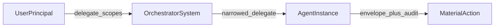

# Roadmap

This document extends the product direction described in [goal.md](goal.md) and [primary-idea.md](primary-idea.md). It is not a commitment to ship dates.

## Multi-principal handoff and delegation visibility

### Handoff primitives

Support explicit **delegation steps** where principal A (human, service account, IdP subject, or peer agent) issues a **narrowed** capability to principal B (the runtime agent), with **monotone** scope reduction: downstream actors receive at most what upstream received, never more. Optional caveats should include **time bounds**, **audience** (who may rely on the delegation), and **trace** or **session** binding so a token cannot be replayed in unrelated contexts. Conceptually this aligns with attenuating delegation (for example macaroons or biscuits) as discussed in the primary idea document; the roadmap does not lock a single cryptographic format until an adapter is implemented.

### Envelope reflection

Use and extend the existing [`Delegation`](src/autonomous_identity/core/envelope.py) model on `IdentityEnvelope.delegations`: each handoff appends a **structured delegation record** (`parent_subject`, `child_subject`, `allowed_scopes`, `caveats`, optional `expires_at`). Validators already sketch **attenuable** checks (delegations must narrow scopes); future work ties **material actions** to the **active delegation chain** at action time, not only to the agent’s static identity.

### Audit reflection

Each **handoff event** and each **material action** performed under delegated authority should produce **append-only audit** records that reference **which delegation edge** was in force when the action ran. Investigations should be able to answer: who handed off to whom, for which scopes, under which caveats, and at what time—without relying on a flat session token minted once at login.

### Cross-system handoff and Merkle DAG

For **federated** or **multi-system** setups (for example organization IdP plus workload controller plus agent runtime), a single action may need to cite **multiple parents** at once: user intent, orchestrator instruction, runtime attestation snapshot, and policy decision. The linear **Merkle chain** adapter is a deliberate MVP choice; a later **Merkle DAG** (or equivalent graph commitment) is the natural fit so handoff evidence is not flattened into an arbitrary ordering. That work is explicitly **post-MVP** and composes with the same `IdentityEnvelope` and lifecycle model.

### API and CLI (planned, not shipped)

- Implement `IdentityAdapter.delegate(...)` end-to-end. Today [`MerkleChainIdentityAdapter`](src/autonomous_identity/adapters/merkle_chain.py) raises `NotImplementedError` for `delegate`; the protocol in [`adapters/base.py`](src/autonomous_identity/adapters/base.py) already defines the hook.
- Add facade helpers (names TBD), for example `handoff(from_envelope, to_child_subject, caveats)` that build a new envelope with an appended `Delegation` and a new Merkle (or DAG) node.
- Add CLI commands such as `asid delegate` to record a handoff in storage and emit an auditable receipt.

## Framework UX (after delegation exists)

- **LangChain:** support **per-tool scope maps** so each tool’s required scope can be checked against `envelope.delegations` after delegation and attenuation are first-class.
- **Langflow:** extend [examples/langflow/README.md](examples/langflow/README.md) with patterns such as **handoff node → agent** flows, reusing [`wrap_tools_for_identity`](src/autonomous_identity/integrations/langflow/wrap_tools.py) once delegation metadata is available on the envelope used inside `identity.exercise(...)`.

## Diagram: handoff chain

Delegation edges are stored on the envelope and cited again on each material action’s audit path.

