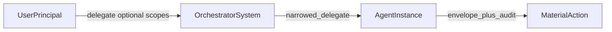

# Roadmap

This document tracks **phases** from [goal.md](goal.md) (“The best phased roadmap”) against this repository, and points to [primary-idea.md](primary-idea.md) for the eight-property envelope story. It is not a commitment to ship dates.

---

## Phase 1: Prove the envelope

**Goal** ([goal.md](goal.md)):

> Every material action gets a signed, auditable identity envelope.

**Deliverables** (goal): `IdentityEnvelope`, `MerkleIdentityNode`, lifecycle registry, audit store, action decorator, verify command.

**Status in this repo**

| Deliverable | Notes |
|-------------|--------|
| `IdentityEnvelope` + validator | Shipped: [`core/envelope.py`](src/autonomous_identity/core/envelope.py), [`core/validators.py`](src/autonomous_identity/core/validators.py). |
| Merkle chain adapter | Shipped: [`adapters/merkle_chain.py`](src/autonomous_identity/adapters/merkle_chain.py). |
| Lifecycle + audit stores | Shipped: file (default), SQLite, memory; optional Postgres extra ([`storage/`](src/autonomous_identity/storage/), [`application/config.py`](src/autonomous_identity/application/config.py)). |
| Material actions | Shipped: `material_action` / `run_material_action` on [`AutonomousIdentity`](src/autonomous_identity/application/facade.py). |
| CLI verify / issue / revoke / inspect | Shipped: [`cli/main.py`](src/autonomous_identity/cli/main.py). |

**Still to deepen:** audit payloads that cite **delegation edge ids** explicitly (see Phase 2); richer “verify the whole chain” UX where the adapter supports it.

---

## Phase 2: Prove delegation

**Goal** ([goal.md](goal.md)):

> A parent autonomous system can delegate narrowed authority to a child system.

**Deliverables** (goal): `Delegation` object, scope narrowing, caveats, expiry, no authority expansion.

**Status in this repo**

| Deliverable | Notes |
|-------------|--------|
| `Delegation` on `IdentityEnvelope` | Shipped: [`core/envelope.py`](src/autonomous_identity/core/envelope.py). |
| Scope narrowing (monotone) | Shipped when `allowed_scopes` is non-empty; optional root `metadata["issuer_scopes"]`; **stripped on delegated children**; effective set via [`delegation_util.py`](src/autonomous_identity/core/delegation_util.py). |
| Identity-only handoff | Shipped: `allowed_scopes` may be `[]` (no capability strings on that edge). |
| Caveats | Stored on each `Delegation`; **enforcement** of caveat semantics is still light / caller-driven. |
| Expiry | Shipped on validate and material-action paths. |
| No expansion | Shipped in Merkle `delegate` + tests. |
| Optional **asid** vocabulary | Documented + opt-in enforcement: [docs/SCOPE_CONVENTION.md](docs/SCOPE_CONVENTION.md). |

**Still roadmap:** richer **caveat enforcement**, **multi-hop policy UX**, **`handoff` sugar** for multi-party graphs, **delegation-edge ids** in audit rows, first-class **LangGraph / FastMCP** helpers (beyond examples).

**Cross-system (post linear-MVP):** Merkle **DAG** or equivalent when an action must commit to **multiple parents** at once ([primary-idea.md](primary-idea.md) Merkle DAG section)—see end of this file.

---

## Phase 3: Prove framework adoption

**Goal** ([goal.md](goal.md)):

> LangChain/LangGraph developers can use it without understanding the cryptographic internals.

**Deliverables** (goal): LangChain tool wrapper, LangGraph node wrapper, FastMCP tool middleware, simple config file.

**Status in this repo**

| Deliverable | Notes |
|-------------|--------|
| LangChain | Shipped: [`integrations/langchain.py`](src/autonomous_identity/integrations/langchain.py); docs in README / HOWTO. |
| LangGraph | Shipped: [`integrations/langgraph.py`](src/autonomous_identity/integrations/langgraph.py); demo [`examples/langgraph_multi_agent_delegation.py`](examples/langgraph_multi_agent_delegation.py). |
| Langflow | Partial: [`integrations/langflow/wrap_tools.py`](src/autonomous_identity/integrations/langflow/wrap_tools.py); [examples/langflow/README.md](examples/langflow/README.md) — extend with **handoff → agent** patterns and per-tool scope maps. |
| FastMCP | Partial: used in **examples** (e.g. MCP research server + LangGraph demo); no dedicated **`integrations/fastmcp.py`** middleware package yet. |
| Simple config | Shipped: YAML + `from_config` / `AutonomousIdentity.local` ([`application/config.py`](src/autonomous_identity/application/config.py)). |

**Still roadmap:** **per-tool scope maps** for LangChain; Langflow docs and UX above; optional **FastMCP middleware** module mirroring LangChain’s pattern.

---

## Phase 4: Add provenance

**Goal** ([goal.md](goal.md)):

> The envelope links to code, model, config, policy, and deployment hashes.

**Deliverables** (goal): `ProvenanceReference`, build metadata loader, hashes on envelope fields.

**Status in this repo**

| Deliverable | Notes |
|-------------|--------|
| `ProvenanceReference` on envelope | Shipped: [`core/envelope.py`](src/autonomous_identity/core/envelope.py); validator requires provenance (or dev placeholder in development strictness). |
| Build metadata **loader** | **Pending:** automatic ingestion from CI / artefact / SBOM into issue context (today callers pass hashes explicitly). |
| Richer provenance fields in practice | Incremental: optional hashes already in struct; deeper SLSA/in-toto style wiring leans toward Phase 5. |

---

## Phase 5: Add enterprise adapters

**Goal** ([goal.md](goal.md)):

> The same envelope can use real enterprise identity/provenance systems.

**Deliverables** (goal): SPIFFE adapter, SLSA/in-toto adapter, COSE/JWS adapter, Vault/KMS signer, Postgres audit store.

**Status in this repo**

| Deliverable | Notes |
|-------------|--------|
| Postgres stores | Optional extra: see pyproject / README. |
| SPIFFE, SLSA/in-toto, COSE/JWS, Vault/KMS | **Not started** as first-class adapters (intentionally out of early scope per goal.md). |

---

## Beyond goal.md Phase 5

[goal.md](goal.md) “winning path” ends with **hybrid identity profiles** after enterprise adapters. Related directions from [primary-idea.md](primary-idea.md):

- **Merkle DAG** (multi-parent identity graph) instead of flattening federated context into a single linear chain.
- **Explicit delegation-edge ids** and audit indexing for investigations.
- Items goal.md lists as **not** in version 1 (DID/VC, hardware attestation, threshold signatures, distributed ledger, etc.) remain **out of scope** until a deliberate phase pulls them in.

---

## Design alignment (primary idea)

- The **eight envelope properties** in [primary-idea.md](primary-idea.md) (persistent through auditable) are **identity at the moment of exercise**.
- **`issuer_scopes`** (root only), **`Delegation.allowed_scopes`**, and **`required_scope`** are an **optional authorization transport** on the same artifact—not a ninth identity property. Optional **`asid:`** grammar: [docs/SCOPE_CONVENTION.md](docs/SCOPE_CONVENTION.md).
- Attenuating tokens in the primary idea map to the **delegation layer**; this library keeps that layer separate from the proof of *who* acted.

## Diagram: handoff chain

Delegation edges live on the envelope. Optional scope strings narrow **authority** on each hop; the envelope core answers **who** (Table 8.1 in [primary-idea.md](primary-idea.md)).

