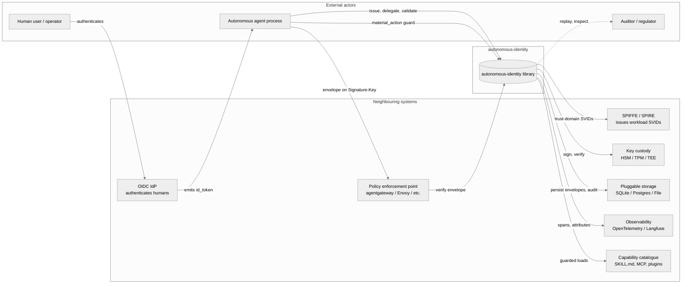
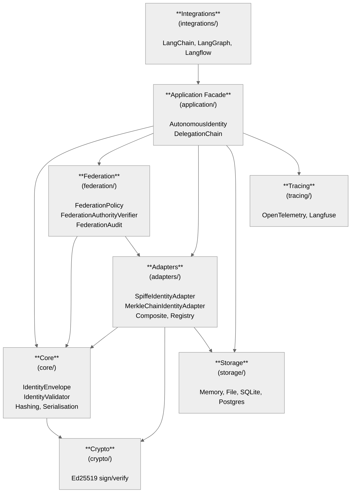
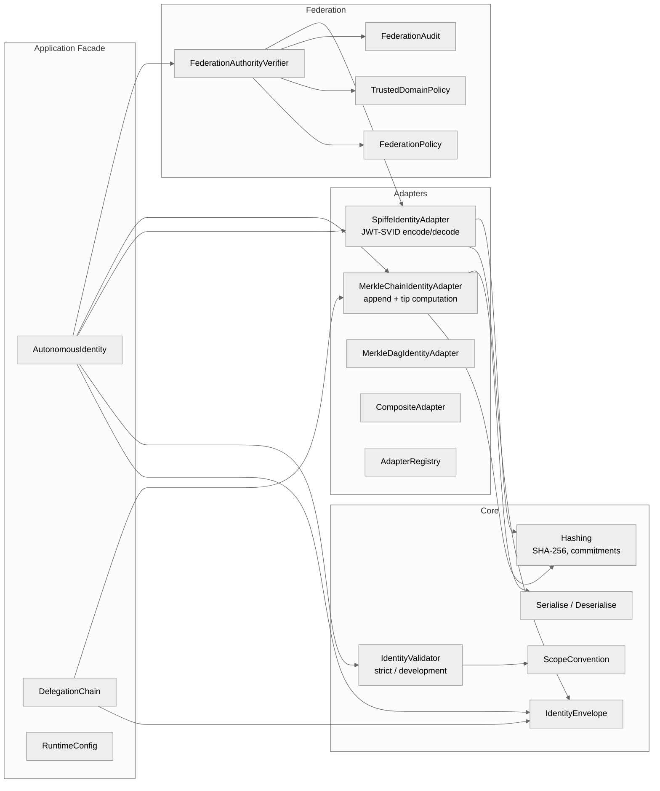
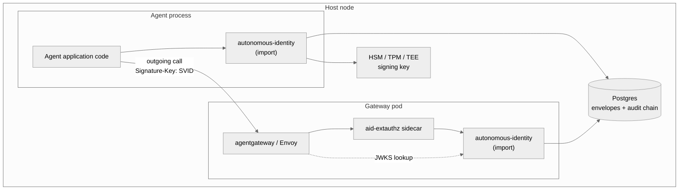

# Architecture — `autonomous-identity`

System: **autonomous-identity** — a Python library that provides verifiable identity envelopes for material actions taken by autonomous agents.

Audience: lead architects integrating the library into a platform; reviewers assessing fit for production; contributors joining the codebase.

Companion documents: [`whitepaper.html`](whitepaper.html) for the conceptual rationale; [`diagrams/`](diagrams/) for the editable Draw.io sources of every diagram in this document.

> **Notation note.** The original brief asked for "C3" model diagrams. C3 is not a recognised architectural notation; we have used the standard **C4 model** (Simon Brown) at Levels 1–3 — System Context, Container, Component. The original brief is preserved in section headings to avoid surprise.

---

## Executive summary

Autonomous agents make decisions, take actions, and invoke tools on behalf of humans and other systems. The identity layer that worked for human-at-a-keyboard authentication — a single check at the door producing a long-lived session — breaks the moment an agent calls another agent that calls a tool. `autonomous-identity` provides the substrate that should be carried in place of a session: a signed envelope that travels with the work, attenuates as authority crosses boundaries, federates between trust domains, and emits a tamper-evident audit chain that ties every leaf action back to the originating human.

The library is built around six structural principles (see section 3) and addresses sixteen functional requirements (section 2). It composes with — does not replace — OIDC for human authentication, SPIFFE for workload identity, and OPA / Cedar for policy decisions. It supplies what those systems deliberately leave out: the carrier object that makes provenance, attenuation, and replay operational across multi-hop agent chains.

Three operating capabilities follow from the design: **provenance** (any leaf action is traceable in one walk back to the user who originated it), **attenuation** (a child envelope's authority is a strict subset of the parent's, enforced before signing), and **federation** (cross-tenant invocation is an explicit, audited recognition event).

The remainder of this document defines the use cases the library was built for, the functional and non-functional requirements it satisfies, the design principles and assumptions it rests on, and the C4 architecture across context, container, and component levels. Section 8 covers deployment shapes; section 9 covers the operational sequences the runtime produces. All diagrams are editable Draw.io files under [`diagrams/`](diagrams/).

### Features at a glance

| # | Feature | What it does | Primary component | Requirement coverage |
|---|---|---|---|---|
| F-01 | **Identity envelope** | Signed structured record with eight properties (identity, capability, lineage, lifecycle, proof). | `IdentityEnvelope` | FR-01, NFR-01, NFR-03 |
| F-02 | **Attenuated delegation** | Issues a child envelope whose effective scopes are a strict subset of the parent's. | `AutonomousIdentity.delegate()`, `DelegationChain` | FR-02, FR-03, NFR-03 |
| F-03 | **Strictness-graded validation** | `strict` mode requires all eight properties; `development` mode is permissive for local work. | `IdentityValidator(strictness=…)` | FR-04, NFR-08 |
| F-04 | **SPIFFE JWT-SVID transport** | Encodes envelopes as JWT-SVIDs signed with Ed25519 stable keys; rehydrates on receipt. | `SpiffeIdentityAdapter` | FR-05, NFR-01 |
| F-05 | **Federation policy** | Per-tenant `FederationPolicy` declares accepted issuers, scope prefixes, TTL ceilings, caveats. | `FederationAuthorityVerifier`, `TrustedDomainPolicy` | FR-06, NFR-12 |
| F-06 | **Effective-scope computation** | Walks the delegation chain and returns the intersected scope set for the current actor. | `effective_scopes_for_actor()`, `DelegationChain` | FR-07 |
| F-07 | **In-process material actions** | Guards SKILL.md loads, plugin executions, retrieval-derived instructions inside the agent. | `material_action()`, `run_material_action()` | FR-08, NFR-07 |
| F-08 | **Pluggable storage** | Memory / SQLite / Postgres / file; backends must satisfy the append-only contract. | `storage/{memory,file,sqlite,postgres}` | FR-09, NFR-11, NFR-14 |
| F-09 | **Lifecycle revocation** | Marks an envelope `revoked` so subsequent verifications refuse with `subject_revoked`. | `AutonomousIdentity.set_lifecycle_state()` | FR-10, NFR-07 |
| F-10 | **Merkle audit chain** | Hash-linked log; tip is recomputable from individual records — tamper-evident by construction. | `MerkleChainIdentityAdapter` | FR-11, NFR-04, NFR-11 |
| F-11 | **Audit replay** | Walks from any leaf back to the originating envelope, verifies tip, returns the chain. | `MerkleChainIdentityAdapter.replay()`, `asid audit replay` | FR-12, FR-16 |
| F-12 | **Runtime integrations** | Opt-in LangChain / LangGraph / Langflow glue; A2A SDK helpers behind the `a2a` extra. | `integrations/*` | FR-13, FR-14 |
| F-13 | **Observability hooks** | Every public API call emits an OpenTelemetry span tagged with `subject` and `audit_ref`. Optional Langfuse adapter. | `tracing/*` | FR-15, NFR-15 |
| F-14 | **CLI inspector** | `asid` command for inspecting, verifying, and replaying envelopes and audit chains. | `cli/main.py` | FR-16 |
| F-15 | **Adapter registry** | Plug new envelope formats or audit shapes without forking the library. | `AdapterRegistry`, `IdentityAdapter` base | NFR-10 |

---

## 1. Use cases

The library was built to address six recurring problems in agent-system design. Each use case names the scenario, why the library applies, which surfaces it uses, and the named failure mode it prevents.

### UC-01 — Multi-agent task delegation

**Scenario.** An orchestrator agent decomposes a user-issued task into subtasks and delegates each to a specialist worker agent (research, summarisation, write-out). The user has authorised the overall task, not each subtask.

**Why this library.** Each subtask delegation has to carry strictly narrower scopes than the orchestrator held. Naïve session forwarding hands every worker the user's full standing.

**Library surfaces.** `AutonomousIdentity.issue()` at the orchestrator; `AutonomousIdentity.delegate()` per subtask; `IdentityValidator(strict)` at every receiver; the delegation chain is the audit trail.

**Failure mode prevented.** A worker pivoting the user's permissions to a different operation. The library refuses to mint an envelope with scopes not present in the parent.

### UC-02 — Cross-tenant agent invocation

**Scenario.** A supply-chain agent in tenant A invokes a market-analysis agent owned by a partner organisation (tenant B). The two tenants run independent infrastructure with no shared session.

**Why this library.** Federation has to be a deliberate, audited recognition with explicit policy — not header injection or a shared service account.

**Library surfaces.** `FederationPolicy` written by tenant B; `TrustedDomainPolicy` for the issuer allow-list; `FederationAuthorityVerifier` runs at the boundary and emits `FED_VERIFY`.

**Failure mode prevented.** Implicit cross-tenant trust based on side-channel signals. The library refuses cross-domain envelopes that don't pass the explicit policy, with named reasons (`trust_domain_not_trusted`, `jurisdiction_denied`, `ttl_exceeded`).

### UC-03 — Dynamic capability loading

**Scenario.** A research agent loads a SKILL.md or MCP tool spec from a catalogue at runtime and runs the instructions it contains. The gateway saw the fetch; it did not see the agent decide to interpret the fetched content.

**Why this library.** Dynamic capability is invisible to the network surface. The decision to *interpret* the bytes needs to be enforced in-process.

**Library surfaces.** `material_action()` decorator around the load step; `required_scope` parameter encodes which envelope scope is needed to execute the loaded content.

**Failure mode prevented.** Untrusted instructions running with the agent's full scope set. The in-process guard refuses to execute when the envelope's scopes don't include the required capability — even though the gateway-side fetch was legal.

### UC-04 — Regulated AI tool use

**Scenario.** A financial-services agent uses a research tool to assist a human advisor. The regulator (FINRA, FCA, BaFin) requires that each client interaction's tool use can be traced to a specific client question.

**Why this library.** The audit chain links the leaf tool call back to the originating advisor-with-client interaction. There is no log-correlation; one walk.

**Library surfaces.** `MerkleChainIdentityAdapter` produces the chain; `parent_audit_ref` on every envelope propagates the originating identifier; `asid audit replay` produces the reconstruction in evidence form.

**Failure mode prevented.** Audit responses that take a week of cross-system log-diving and produce probabilistic narratives. The chain is one structure; walking it is one operation.

### UC-05 — Post-incident forensic replay

**Scenario.** Production incident: a `delete_records` MCP tool was invoked. The CISO needs to know who authorised it, through which delegation chain, against which envelope state, within the hour.

**Why this library.** The hash-linked audit chain has tamper-evident properties; recomputing the Merkle tip from the individual records confirms the chain has not been altered. The walk from leaf to root is constant memory.

**Library surfaces.** `MerkleChainIdentityAdapter.replay(leaf_ref)`; tip verification against stored value; named-reason refusal records (`EXTAUTHZ_DENY`, `MATERIAL_DENY`, `FED_DENY`).

**Failure mode prevented.** Plausibly deniable logs; tampered evidence accepted as authoritative. The chain breaks loudly if any record is modified.

### UC-06 — Multi-tenant SaaS authority isolation

**Scenario.** A platform runs multiple customers' agents on shared infrastructure. Tenant T1's agent must never be able to act with tenant T2's authority, even by mistake, even if both agents share a service identity at the workload layer.

**Why this library.** The SPIFFE trust domain is the tenant boundary. Scopes are tenant-prefixed by convention. Federation between tenants is opt-in and policy-checked, not implicit.

**Library surfaces.** `TrustedDomainPolicy` allow-list per tenant; scope prefix convention (`tenant-a:tool:*` vs `tenant-b:tool:*`); subject revocation per envelope; storage isolation enforced by audit-chain key partitioning.

**Failure mode prevented.** Cross-tenant capability leakage. An envelope from T1 that requests a scope reachable in T2's namespace fails verification at T2's gateway with `trust_domain_not_trusted`.

### UC-07 — Agentic CI/CD pipelines with per-step authorisation

**Scenario.** A continuous-deployment pipeline runs as a chain of agents — plan, build, scan, deploy, verify — each step requiring different authority. The deploy step alone should hold production-write scopes; the scan step must not.

**Why this library.** Each pipeline step gets its own delegated envelope with only the scopes that step needs. A compromised build step cannot make a deploy call because the build step's envelope does not carry the deploy scope.

**Library surfaces.** Per-step `delegate()` with explicit narrow scopes; `IdentityValidator(strict)` at each transition; audit chain provides the end-to-end provenance the platform team can show during change-management review.

**Failure mode prevented.** Lateral movement inside a pipeline: a compromised earlier step pivoting to a production-affecting later capability.

---

## 2. Requirement analysis

### 2.1 Functional requirements

| ID | Requirement | Driven by | Surface |
|---|---|---|---|
| FR-01 | Issue an envelope for a named subject with explicit issuer scopes. | Bootstrapping a root identity at process startup. | `AutonomousIdentity.issue()` |
| FR-02 | Delegate a child envelope from a parent, with strictly attenuated scopes. | Multi-hop agent chains. | `AutonomousIdentity.delegate()` |
| FR-03 | Refuse delegation requests that ask for scopes not present in the parent's effective set. | Attenuation invariant. | Raises `ValidationError` with reason `scope_not_in_effective`. |
| FR-04 | Validate an envelope against a configurable strictness mode (`development`, `strict`). | Different deployments tolerate different completeness. | `IdentityValidator(strictness=…)` |
| FR-05 | Encode/decode envelopes as JWT-SVIDs signed with Ed25519 stable keys. | SPIFFE interoperability and transport over `Signature-Key` header. | `SpiffeIdentityAdapter` |
| FR-06 | Verify federation envelopes presented by foreign trust domains against a per-policy `FederationPolicy`. | Cross-tenant invocation. | `FederationAuthorityVerifier` |
| FR-07 | Compute the effective scope set for an actor by intersecting the chain. | Per-call authorisation decisions. | `effective_scopes_for_actor()` |
| FR-08 | Run a `material_action` as an in-process guard that requires a named scope. | Behaviours invisible to network-surface enforcement. | `material_action()` decorator / `run_material_action()` |
| FR-09 | Persist envelopes and lifecycle state in a pluggable backend. | Operational deployment. | `storage/` — memory, sqlite, postgres, file. |
| FR-10 | Mark an envelope `revoked` so subsequent verifications refuse it. | Operational response to compromise or completion. | `AutonomousIdentity.set_lifecycle_state()` |
| FR-11 | Emit a tamper-evident audit chain whose tip is a Merkle commitment. | Replayable provenance. | `MerkleChainIdentityAdapter` |
| FR-12 | Replay an audit chain from any leaf record back to the originating envelope. | Post-incident review. | `MerkleChainIdentityAdapter.replay()` |
| FR-13 | Provide adapter integrations for LangChain, LangGraph, and Langflow runtimes. | Plug-in to existing agent platforms. | `integrations/` |
| FR-14 | Provide an A2A SDK wiring (`extra=a2a`) for sending the envelope as request metadata. | Interop with the agent-to-agent protocol. | A2A-specific helpers in `integrations/` |
| FR-15 | Emit OpenTelemetry / Langfuse traces tagged with envelope identifiers. | Observability. | `tracing/` |
| FR-16 | Expose a CLI (`asid`) for inspection, verification, and replay. | Operator diagnostics. | `cli/main.py` |

### 2.2 Non-functional requirements

| ID | Category | Requirement | Acceptance test |
|---|---|---|---|
| NFR-01 | Security | All envelopes that reach a policy decision are signed by a key whose public component is published in a known JWKS. | Integration test injects an unsigned envelope; validator refuses with `signature_missing`. |
| NFR-02 | Security | The library does not log envelope contents at info or above. | Static check on `log` calls in the source tree; CI lint. |
| NFR-03 | Security | Scope attenuation is enforced before signing the child envelope. | Property test: random scope sets; delegated child must satisfy `child.scopes ⊆ parent.scopes`. |
| NFR-04 | Security | Audit records are committed in a hash chain whose tip is recomputable from individual records. | Tamper-detection test: modify any record; tip recomputation fails. |
| NFR-05 | Performance | Envelope verification (Ed25519) completes in < 1 ms at p50 on commodity hardware. | Benchmark in `tests/perf/`. |
| NFR-06 | Performance | Effective scope computation for a depth-8 chain completes in < 100 μs at p50. | Benchmark. |
| NFR-07 | Reliability | A revoked envelope never passes verification regardless of cache state. | Test: revoke; verify against in-process cache; refuse with `subject_revoked`. |
| NFR-08 | Reliability | Validator behaviour is deterministic given the same inputs. | No clock-dependent decisions in `strict` mode except lifecycle expiry. |
| NFR-09 | Portability | Supports CPython 3.12+. No native-code dependencies beyond `cryptography`. | CI matrix. |
| NFR-10 | Maintainability | New adapter implementations require only the `IdentityAdapter` base interface. | Adapter registry plug-in test. |
| NFR-11 | Compliance | Audit records are written in append-only mode; backends must reject in-place mutation. | Storage contract test. |
| NFR-12 | Compliance | Federation acceptance decisions are themselves audit-logged before forwarding. | `FED_VERIFY` record emitted; visible in audit chain. |
| NFR-13 | Operability | Configuration is loaded from one source (`RuntimeConfig`) at process start, not at call time. | Code review check; no `os.environ.get` inside the call path. |
| NFR-14 | Operability | The library degrades safely when the storage backend is unavailable — refuse, do not silently accept. | Fault-injection test: kill storage; verify all verifications refuse. |
| NFR-15 | Observability | Every public API call emits a span (OpenTelemetry) with envelope `subject` and `audit_ref` attributes. | Trace inspection test. |

---

## 3. Key design principles

The library is governed by six design principles. Each principle is enforced by a structural property of the codebase, not by convention.

1. **The envelope is the only authoritative input.** All authorisation decisions consult the envelope. Side-channels — request headers, environment variables, ambient session state — are not consulted at decision time. The structural enforcement is that policy-evaluating functions take `IdentityEnvelope` as a required argument; there is no global `current_identity()` to reach for.

2. **Authority narrows, never widens.** A child envelope's effective scopes are a strict subset of the parent's. The structural enforcement is that the delegation API computes the child's scopes by intersection inside `delegate()`; callers cannot construct a child envelope with scopes outside the parent's set without bypassing the API.

3. **Trust is signed, not asserted.** Identity claims are accepted only after Ed25519 signature verification against a published JWKS. The structural enforcement is that the validator refuses to operate on raw envelope dictionaries; only SVID-rehydrated envelopes pass.

4. **Audit is a write-once chain.** Records cannot be modified after emission. Storage backends must implement the append-only contract; the contract is enforced by a storage test suite all backends must pass.

5. **Federation is an explicit decision.** Cross-domain envelopes pass through a `FederationPolicy` whose acceptance produces an audit record of its own. The structural enforcement is that federation verification emits `FED_VERIFY` before returning success; failure to emit is a violation of the verifier contract.

6. **Failure is named.** Every refusal carries a typed reason (`scope_not_in_effective`, `subject_revoked`, `trust_domain_not_trusted`, etc.). Generic `False`/`raise Exception` is not permitted; the test suite asserts presence of a reason on every denial path.

---

## 4. Key assumptions

The architecture rests on assumptions whose violation would invalidate the model. Each assumption has an external owner.

1. **Each subject owns a stable Ed25519 private key.** The integrator manages key custody — typically via HSM, TPM, or TEE. The library does not generate or store the stable key; it only signs and verifies.

2. **Trust-domain JWKS is reachable at verification time.** Or the consumer caches it. The library assumes the JWKS lookup function (provided by the integrator) returns the current key set; staleness is the integrator's problem.

3. **System clock is reliable within ± 60 seconds across the deployment.** Lifecycle expiry checks are wall-clock based. NTP-grade synchronisation is assumed.

4. **Storage backend honours append-only semantics.** A backend that allows in-place mutation breaks NFR-04. The library cannot detect a misbehaving backend after the fact.

5. **The transport layer preserves the `Signature-Key` header end-to-end.** Intermediate proxies that strip or mutate headers will silently break verification. The integrator is responsible for transport selection.

6. **A federation policy exists in writing.** The `FederationPolicy` object encodes a recognition decision someone made between two organisations. The library accepts that this decision exists and is up to date; it does not negotiate it.

7. **Agents call `material_action` honestly for their own dynamic loading.** A compromised agent process can bypass in-process guards. Defence-in-depth assumes the gateway surface still enforces; the in-process surface is one layer, not the whole stack.

---

## 5. Context diagram — C4 Level 1 (brief calls this "C3 context")

The system in context: who interacts with `autonomous-identity` and what neighbouring systems it depends on.

**Editable source.** [`diagrams/c4-level-1-context.drawio`](diagrams/c4-level-1-context.drawio) — open in [diagrams.net](https://app.diagrams.net) or the Draw.io desktop app.

**Key relationships.**

- Humans authenticate via OIDC; the id_token seeds the **root envelope** that an agent issues with the library.
- The library uses **SPIFFE/SPIRE** for workload-identity primitives (JWT-SVID format and trust-domain JWKS).
- The library never holds the **stable signing key** itself; it signs through a configured key-custody backend.
- The **policy enforcement point** (gateway) calls into the library — directly or via an ExtAuthz sidecar — to verify envelopes presented on the wire.
- The **capability catalogue** is whatever the agent dynamically loads at runtime; `material_action` guards every load.
- **Auditors / regulators** consume the audit chain by replay; they never touch the live system.

---

## 6. Architecture description

`autonomous-identity` is a Python library, not a service. It runs in-process inside three roles: the agent that issues and delegates envelopes; the receiver that verifies them; and the ExtAuthz-style sidecar that verifies envelopes on behalf of a gateway. The same code is loaded into all three; the role is a function of the call sequence, not the deployment.

### Layered model

The library is organised in five horizontal layers, each depending only on the layer below.

| Layer | Responsibility | Key modules |
|---|---|---|
| **Application** | Public facade. Composes core + adapters + storage into the operations integrators call. | `application/facade.py`, `application/delegation_chain.py` |
| **Federation** | Cross-domain envelope recognition. Policies, verifiers, federation audit. | `federation/{model,verifier,audit}.py` |
| **Adapters** | Pluggable transport and audit shapes. SPIFFE SVID encoding/decoding; Merkle chain and DAG audit. | `adapters/{spiffe,merkle_chain,merkle_dag,registry}.py` |
| **Core** | Envelope data model, validator, hashing, serialisation, scope convention. | `core/{envelope,validators,hashing,serialize,scope_convention}.py` |
| **Infrastructure** | Crypto primitives, storage backends, runtime config, tracing. | `crypto/`, `storage/`, `config/`, `tracing/` |

A separate `integrations/` directory holds opt-in glue for LangChain, LangGraph, and Langflow runtimes. Integrations depend on the public facade only; they never reach into core or adapters directly.

### Control flow at runtime

The library has three primary operations: **issue**, **delegate**, and **verify**. Each operation is a synchronous function call on the facade. There are no background threads; there is no network I/O within the operation itself. Storage I/O is synchronous and bounded.

An **audit emission** is bolted on the end of each operation. The audit record is constructed, hashed against the previous record's commitment, and written through the storage backend. If the backend refuses the write, the operation refuses too — audit is a hard precondition, not a side-effect.

### Concurrency model

The library is **thread-safe by design** for verification (read-only) operations. Issue and delegate operations are **single-writer per subject**: integrators are expected to serialise writes per subject identifier, either by routing or by external locking. The library asserts this with optimistic concurrency on the audit head pointer; concurrent writes to the same chain produce a `chain_head_advanced` error rather than corrupting the chain.

### Error model

Every public call either returns or raises one of four named exceptions:

- `ValidationError` — envelope fails validation. Always carries a typed `reason`.
- `VerificationError` — signature verification failed.
- `LifecycleError` — envelope is revoked or expired.
- `AdapterNotFoundError` — registry miss.

Refusal reasons are stable strings; integrators can switch on them. They form the contract the demo audit logs print: `scope_not_in_effective`, `trust_domain_not_trusted`, `subject_revoked`, `ttl_exceeded`, `jurisdiction_denied`, `chain_head_advanced`.

---

## 7. Component model — C4 Levels 2 and 3

### 7.1 Container view (C4 Level 2)

A "container" in C4 is an independently deployable / executable unit. `autonomous-identity` is one library, but it composes seven internally separable containers. The container view shows their dependencies.

**Editable source.** [`diagrams/c4-level-2-container.drawio`](diagrams/c4-level-2-container.drawio).

**Container responsibilities.**

| Container | Responsibility | Why it exists as a separate unit |
|---|---|---|
| **Application Facade** | Composes the library's surfaces into the four operations integrators call (`issue`, `delegate`, `verify`, `material_action`). | One coherent API; one place to add cross-cutting concerns (audit emission, tracing, config). |
| **Core** | The envelope data model, validator, scope-convention rules, serialisation, and hashing. | Pure data and rules. No I/O. Testable in isolation. |
| **Federation** | Cross-domain envelope recognition and federation-specific audit. | Federation rules differ from intra-domain rules; isolating them keeps the core validator simple. |
| **Adapters** | Pluggable encoding / decoding (SPIFFE SVID, future formats) and pluggable audit shape (Merkle chain vs DAG). | Lets integrators swap formats without forking the library. |
| **Storage** | Persistence for envelopes, lifecycle state, and audit records. | Different deployments choose different backends. |
| **Crypto** | Ed25519 sign / verify primitives. | Single integration surface for HSM / TPM / TEE-backed keys. |
| **Tracing** | OpenTelemetry and Langfuse instrumentation. | Optional; integrators opt in via extras. |
| **Integrations** | LangChain / LangGraph / Langflow glue. | Optional; each integration is a separate import path. |

### 7.2 Component view (C4 Level 3)

The component view zooms into the four containers that do the structural work: **Core**, **Adapters**, **Federation**, and **Application Facade**.

**Editable source.** [`diagrams/c4-level-3-component.drawio`](diagrams/c4-level-3-component.drawio).

**Component descriptions.**

| Component | Responsibility | Notes |
|---|---|---|
| `AutonomousIdentity` (facade) | One-stop entry point. Composes validator + adapters + storage + tracing into `issue`, `delegate`, `verify`, `material_action`. | All cross-cutting concerns live here; everything else is pure. |
| `DelegationChain` | Helper for walking the parent-of-parent-of-parent lineage to compute the effective scope set. | Pure function over envelopes; no I/O. |
| `RuntimeConfig` | Loaded once at process start. Strictness mode, default scope convention, audit backend choice. | Immutable after load. |
| `IdentityEnvelope` | Frozen dataclass with the eight envelope properties: subject, trust_domain, scopes, lineage, lifecycle, signature. | The atomic unit of the library. |
| `IdentityValidator` | Enforces strictness rules: which properties must be present, what their constraints are. | `strict` mode requires all eight properties; `development` is permissive. |
| `Hashing` | SHA-256-based commitment helpers used by the audit chain and by envelope identity. | Single place to swap hash if needed for compliance. |
| `Serialise / Deserialise` | Canonical JSON encoding of envelopes for signing and storage. | Determinism matters — signature stability depends on canonical form. |
| `ScopeConvention` | Optional checker that enforces scope naming conventions (`tool:*`, `tasks:*`). | Off by default; integrators can opt in. |
| `SpiffeIdentityAdapter` | Encodes / decodes JWT-SVIDs. Signs envelopes for the wire; rehydrates them on receipt. | Uses `Crypto` for the actual Ed25519 ops. |
| `MerkleChainIdentityAdapter` | Audit log as a hash-linked chain. Tip is recomputable from records. | Default audit shape; what the demos use. |
| `MerkleDagIdentityAdapter` | Audit log as a DAG (for branching delegation trees). | Use when one envelope is delegated to multiple children concurrently. |
| `CompositeAdapter` | Combines multiple adapters for a multi-format deployment. | Rarely needed; included for migration scenarios. |
| `AdapterRegistry` | Module-level registry; integrators register new adapters here. | Lets the facade lookup by name from config. |
| `FederationPolicy` | Per-tenant policy: accepted issuers, scope prefixes, TTL ceiling, caveat requirements. | Written by the organisation that owns the receiving trust domain. |
| `TrustedDomainPolicy` | Allowlist of trust domains the receiver is willing to entertain. | Coarser-grained than `FederationPolicy`; combined at verification. |
| `FederationAuthorityVerifier` | Runs an envelope through `TrustedDomainPolicy` then `FederationPolicy`, emits `FED_VERIFY`, returns the rehydrated envelope. | Where named failure reasons originate. |
| `FederationAudit` | Federation-specific audit record types: `FED_VERIFY`, `FED_DENY`. | Records flow into the same chain as intra-domain audits. |

---

## 8. Deployment model

The library is deployed by being imported. There is no service to start. What varies across deployments is **where** the library is imported and **which** storage and crypto backends it is wired to.

### 8.1 Three deployment shapes

| Shape | Where the library runs | Storage | Crypto | Typical use |
|---|---|---|---|---|
| **A. In-agent** | Inside the agent process. | File or SQLite, local to the agent. | Ed25519 key on disk (dev) or HSM/TPM (prod). | Smallest deployment. The agent issues, delegates, and verifies its own peers' envelopes. |
| **B. ExtAuthz sidecar** | Inside an ExtAuthz gRPC service that fronts agentgateway / Envoy. | Postgres or SQLite shared across receivers. | Verify-only — no signing key required. | Verification at the network edge. The library answers per-call ExtAuthz queries from the gateway. |
| **C. Library + sidecar (recommended)** | Both A and B simultaneously. Agents issue and delegate using shape A; the gateway verifies using shape B. | Postgres for the chain; the same database both sides write into. | Sign in A (HSM-backed). Verify in B (no key). | Production. Defence-in-depth across surfaces. |

### 8.2 Logical deployment view

The diagram below shows the recommended **Shape C** deployment in a single trust domain. Federation deployments add a second instance of the same shape in the receiving tenant.

**Editable source.** [`diagrams/deployment-model.drawio`](diagrams/deployment-model.drawio).

### 8.3 Deployment notes

- **Stateless library.** There is no in-memory state shared across calls beyond a JWKS cache. Restart safety is the storage backend's responsibility.
- **Key custody is the only stateful trust anchor.** Losing the signing key compromises future issuance; revoking the published JWKS entry stops verification of new envelopes signed by that key.
- **Postgres is the recommended backend for production.** SQLite works for single-host demos; the file backend is for development and never for production.
- **Tracing is opt-in.** Install the `tracing-otel` or `tracing-langfuse` extras; otherwise the library does not import the OpenTelemetry or Langfuse SDKs.
- **A2A interop is opt-in.** Install the `a2a` extra; otherwise the library does not depend on `a2a-sdk`.
- **Federation requires two deployments.** Each trust domain runs its own shape-C instance; recognition is configured in each.

---

## 9. Operational model

The operational model describes the **runtime behaviour** — the sequence of events from envelope issuance through to audit emission — that the deployed system produces under load.

The operational model is captured in a **separate Draw.io diagram** so it can be edited, annotated, and re-exported by operators without changing this document. The diagram lives at:

> [`diagrams/operational-model.drawio`](diagrams/operational-model.drawio)

Open it in [diagrams.net](https://app.diagrams.net) or the Draw.io desktop app. The diagram shows the four canonical runtime sequences:

1. **Bootstrap.** Agent starts → issues root envelope → caches stable signing key → registers in JWKS publisher.
2. **Delegate.** Agent receives a call → reads envelope from `Signature-Key` → delegates to a narrower child → makes outbound call carrying the child.
3. **Verify.** Gateway receives a call → ExtAuthz sidecar → library verifies → returns effective scopes → gateway emits access log.
4. **Audit & replay.** Every operation appends one record to the Merkle chain → operator runs replay → tip is recomputed and matched against stored value.

### 9.1 Producing your own operational diagram

A reusable **skill** is included so any future operational model — for a new agent, a new deployment shape, a new failure mode — can be generated from a short structured prompt. The skill is delivered alongside this document as a `.skill` bundle and can be installed from the file card in chat.

Once installed, invoke it with:

> *"Draw an operational model in draw.io for the following sequence: …"*

The skill produces a `.drawio` file with consistent shape conventions (actor, system, store, audit), arrow semantics (synchronous, asynchronous, audit emission), and lane structure (one swim-lane per role).

---

## Appendix A — diagram index

| Diagram | C4 Level | File |
|---|---|---|
| System Context | 1 | [`diagrams/c4-level-1-context.drawio`](diagrams/c4-level-1-context.drawio) |
| Containers | 2 | [`diagrams/c4-level-2-container.drawio`](diagrams/c4-level-2-container.drawio) |
| Components | 3 | [`diagrams/c4-level-3-component.drawio`](diagrams/c4-level-3-component.drawio) |
| Deployment (Shape C) | — | [`diagrams/deployment-model.drawio`](diagrams/deployment-model.drawio) |
| Operational sequences | — | [`diagrams/operational-model.drawio`](diagrams/operational-model.drawio) |

## Appendix B — module-to-component map

| Component | Source path |
|---|---|
| `AutonomousIdentity` | `src/autonomous_identity/application/facade.py` |
| `DelegationChain` | `src/autonomous_identity/application/delegation_chain.py` |
| `RuntimeConfig` | `src/autonomous_identity/config/runtime_config.py` |
| `IdentityEnvelope` | `src/autonomous_identity/core/envelope.py` |
| `IdentityValidator` | `src/autonomous_identity/core/validators.py` |
| `SpiffeIdentityAdapter` | `src/autonomous_identity/adapters/spiffe.py` |
| `MerkleChainIdentityAdapter` | `src/autonomous_identity/adapters/merkle_chain.py` |
| `MerkleDagIdentityAdapter` | `src/autonomous_identity/adapters/merkle_dag.py` |
| `CompositeAdapter` | `src/autonomous_identity/adapters/composite.py` |
| `AdapterRegistry` | `src/autonomous_identity/adapters/registry.py` |
| `FederationPolicy` | `src/autonomous_identity/federation/model.py` |
| `FederationAuthorityVerifier` | `src/autonomous_identity/federation/verifier.py` |
| `FederationAudit` | `src/autonomous_identity/federation/audit.py` |
| Storage backends | `src/autonomous_identity/storage/{memory,file,sqlite,postgres}.py` |
| Crypto | `src/autonomous_identity/crypto/ed25519.py` |
| Tracing | `src/autonomous_identity/tracing/` |
| Integrations | `src/autonomous_identity/integrations/{langchain,langgraph,langflow}` |
